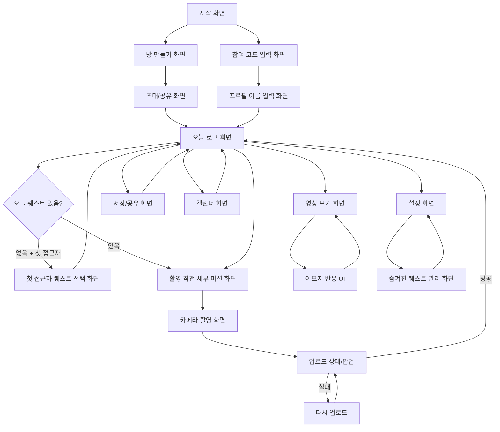

# 화면 흐름도

## 1. 문서 목적

이 문서는 스냅챌 MVP에서 필요한 화면 목록과 화면 간 이동 흐름을 정리한 문서다.

기본 화면 구조는 셋로그를 최대한 참고하되, 스냅챌의 차별점인 “하루 첫 접근자의 퀘스트 선택”과 “촬영 직전 세부 미션 확인” 흐름을 추가한다.

## 2. 전체 화면 목록

| 화면 ID | 화면명 | 목적 |
| --- | --- | --- |
| S-001 | 시작 화면 | 방 만들기 또는 참여 진입 |
| S-002 | 방 만들기 화면 | 방 이름, 모드, 프로필 이름 입력 |
| S-003 | 초대/공유 화면 | 참여 코드와 초대 링크 공유 |
| S-004 | 참여 코드 입력 화면 | 코드로 방 참여 |
| S-005 | 프로필 이름 입력 화면 | 방 참여 전 이름 입력 |
| S-006 | 오늘 로그 화면 | 시간대별 로그 확인, 촬영 진입 |
| S-007 | 첫 접근자 퀘스트 선택 화면 | 오늘의 퀘스트 후보 3개 중 선택 |
| S-008 | 촬영 직전 세부 미션 화면 | 해당 시간대 미션 확인 |
| S-009 | 카메라 촬영 화면 | 2초 영상 촬영 |
| S-010 | 업로드 상태 화면/팝업 | 업로드 진행/실패/재시도 |
| S-011 | 영상 보기 화면 | 시간대별 영상 재생 |
| S-012 | 이모지 반응 UI | 영상에 이모지 반응 |
| S-013 | 저장/공유 화면 | 하루 로그 저장/공유 |
| S-014 | 캘린더 화면 | 날짜별 로그 확인 |
| S-015 | 설정 화면 | 사용자 관련 설정, 방 나가기 |
| S-016 | 숨겨진 퀘스트 관리 화면 | MVP용 퀘스트 데이터 관리 |
| S-017 | 오류 안내 화면/상태 | 방 없음, 방 가득 참 등 안내 |

## 3. 메인 흐름 요약

```
시작 화면
  -> 방 만들기
    -> 방 만들기 화면
    -> 초대/공유 화면
    -> 오늘 로그 화면

시작 화면
  -> 참여 코드 입력
    -> 참여 코드 입력 화면
    -> 프로필 이름 입력 화면
    -> 오늘 로그 화면

초대 링크 진입
  -> 프로필 이름 입력 화면
  -> 오늘 로그 화면
```

## 4. 퀘스트 선택 흐름

```
오늘 로그 화면 진입
  -> 오늘의 퀘스트가 이미 있음
    -> 촬영 직전 세부 미션 화면

오늘 로그 화면 진입
  -> 오늘의 퀘스트가 없음
    -> 사용자가 하루 첫 접근자임
      -> 첫 접근자 퀘스트 선택 화면
      -> 후보 3개 중 1개 선택
      -> 오늘 로그 화면
      -> 촬영 직전 세부 미션 화면
```

## 5. 촬영 흐름

```
오늘 로그 화면
  -> 촬영 가능한 시간대 선택
  -> 촬영 직전 세부 미션 화면
  -> 미션 안내 터치
  -> 카메라 촬영 화면
  -> 2초 촬영
  -> 업로드 상태 화면/팝업
  -> 업로드 성공
  -> 오늘 로그 화면에 영상 반영
```

## 6. 업로드 실패 흐름

```
카메라 촬영 화면
  -> 2초 촬영 완료
  -> 업로드 실패
  -> 업로드 실패 팝업
  -> 다시 업로드 버튼
  -> 업로드 재시도
  -> 성공 시 오늘 로그 화면에 반영
```

## 7. 로그 보기/반응 흐름

```
오늘 로그 화면
  -> 시간대 선택
  -> 영상 보기 화면
  -> 영상 재생
  -> 이모지 반응 UI
  -> 반응 저장
  -> 영상 보기 화면 또는 오늘 로그 화면으로 복귀
```

## 8. 저장/공유 흐름

```
오늘 로그 화면
  -> 저장/공유 버튼
  -> 저장/공유 화면
  -> 기기에 저장 또는 외부 앱 공유
  -> 오늘 로그 화면으로 복귀
```

## 9. 캘린더 흐름

```
오늘 로그 화면
  -> 캘린더 화면
  -> 날짜 선택
  -> 해당 날짜 로그 화면
```

참고: 과거 로그 안정화는 2주 내 어려우면 포기 가능한 범위다.

## 10. 설정 흐름

```
오늘 로그 화면
  -> 설정 화면
    -> 방 나가기
    -> 숨겨진 퀘스트 관리 화면
```

## 11. 방 나가기 흐름

```
설정 화면
  -> 방 나가기 선택
  -> 사용자 방에서 제거
  -> 해당 사용자의 공유 로그 삭제/숨김
  -> 방 안에서 해당 사용자 칸 제거
  -> 모든 인원이 나간 경우 방 삭제
```

## 12. 화면별 상세

## S-001. 시작 화면

### 목적

앱 첫 진입 시 방을 만들거나 기존 방에 참여할 수 있게 한다.

### 주요 요소

- 서비스명: 스냅챌
- 방 만들기 버튼
- 참여 코드 입력 버튼

### 이동

- 방 만들기 -> S-002 방 만들기 화면
- 참여 코드 입력 -> S-004 참여 코드 입력 화면
- 초대 링크로 앱 진입 시 S-005 프로필 이름 입력 화면으로 이동

## S-002. 방 만들기 화면

### 목적

새 방 생성에 필요한 최소 정보를 입력한다.

### 주요 요소

- 방 이름 입력
- 모드 선택
    - 친구
    - 커플
- 프로필 이름 입력
- 방 만들기 버튼

### 이동

- 방 만들기 성공 -> S-003 초대/공유 화면
- 방 만들기 실패 -> 오류 안내 후 재시도

## S-003. 초대/공유 화면

### 목적

생성된 방에 다른 사람을 초대한다.

### 주요 요소

- 참여 코드
- 초대 링크
- 공유 버튼
- 오늘 로그로 이동 버튼

### 이동

- 공유 완료 또는 건너뛰기 -> S-006 오늘 로그 화면

## S-004. 참여 코드 입력 화면

### 목적

코드로 기존 방에 참여한다.

### 주요 요소

- 참여 코드 입력 필드
- 참여하기 버튼

### 이동

- 유효한 코드 -> S-005 프로필 이름 입력 화면
- 잘못된 코드 -> S-017 오류 안내 상태
- 방 정원 초과 -> S-017 오류 안내 상태

## S-005. 프로필 이름 입력 화면

### 목적

방 참여 전 사용자 이름을 입력한다.

### 주요 요소

- 프로필 이름 입력
- 참여하기 버튼

### 정책

- MVP에서는 이름 길이 제한 없음
- 회원가입 없음

### 이동

- 참여 성공 -> S-006 오늘 로그 화면

## S-006. 오늘 로그 화면

### 목적

오늘의 시간대별 로그를 보고, 촬영/영상 보기/공유/설정으로 이동하는 중심 화면이다.

### 주요 요소

- 오늘 날짜
- 오늘의 퀘스트 주제 표시
- 시간대 탭 또는 시간대 목록
- 참여자별 영상 칸
- 미참여 빈/검은 화면
- 촬영 진입 버튼 또는 촬영 가능한 칸
- 저장/공유 버튼
- 캘린더 진입
- 설정 진입

### 이동

- 오늘 퀘스트 없음 + 첫 접근자 -> S-007 첫 접근자 퀘스트 선택 화면
- 촬영 진입 -> S-008 촬영 직전 세부 미션 화면
- 영상 선택 -> S-011 영상 보기 화면
- 저장/공유 -> S-013 저장/공유 화면
- 캘린더 -> S-014 캘린더 화면
- 설정 -> S-015 설정 화면

## S-007. 첫 접근자 퀘스트 선택 화면

### 목적

하루 첫 접근자가 오늘의 퀘스트 주제를 선택한다.

### 주요 요소

- 추천 퀘스트 후보 3개
- 각 후보의 주제명
- 선택 버튼
- 다른 주제 선택 버튼 또는 후보 재선택 영역

### 정책

- 하루 첫 접근자에게만 표시
- 한 번 선택하면 변경 불가
- 선택 후 모든 참여자에게 동일 주제 적용

### 이동

- 퀘스트 선택 완료 -> S-006 오늘 로그 화면 또는 S-008 촬영 직전 세부 미션 화면

## S-008. 촬영 직전 세부 미션 화면

### 목적

촬영 직전에 해당 시간대의 세부 미션을 보여준다.

### 주요 요소

- 오늘의 퀘스트 주제
- 현재 시간대 세부 미션
- 안내 문구
- 터치하여 촬영으로 이동하는 영역

### 정책

- 해당 사용자에게만 보임
- 사용자가 터치해야 촬영 화면으로 넘어감
- 건너뛰기 버튼 없음

### 이동

- 화면 터치 -> S-009 카메라 촬영 화면

## S-009. 카메라 촬영 화면

### 목적

2초 영상을 촬영한다.

### 주요 요소

- 카메라 프리뷰
- 촬영 버튼
- 2초 촬영 진행 표시

### 정책

- 영상 길이 2초
- 같은 시간대 1회 촬영/업로드
- 삭제된 경우 같은 시간대 내 재촬영 가능

### 이동

- 촬영 완료 -> S-010 업로드 상태 화면/팝업
- 촬영 오류 -> 촬영 화면 재시작

## S-010. 업로드 상태 화면/팝업

### 목적

영상 업로드 상태를 안내한다.

### 주요 요소

- 업로드 중 상태
- 업로드 실패 팝업
- 다시 업로드 버튼

### 이동

- 업로드 성공 -> S-006 오늘 로그 화면
- 업로드 실패 -> 다시 업로드 버튼으로 재시도

## S-011. 영상 보기 화면

### 목적

시간대별 영상을 재생한다.

### 주요 요소

- 영상 플레이어
- 촬영자 표시
- 시간대 표시
- 이모지 반응 진입

### 이동

- 이모지 반응 -> S-012 이모지 반응 UI
- 뒤로가기 -> S-006 오늘 로그 화면

## S-012. 이모지 반응 UI

### 목적

영상에 가볍게 반응한다.

### 주요 요소

- 이모지 선택 목록
- 반응 표시

### 정책

- MVP에서는 이모지만 제공
- 댓글/DM 없음

### 이동

- 반응 완료 -> S-011 영상 보기 화면

## S-013. 저장/공유 화면

### 목적

하루 로그를 저장하거나 외부 앱으로 공유한다.

### 주요 요소

- 저장 버튼
- 공유 버튼
- 공유 결과물 미리보기는 MVP에서 선택

### 정책

- 셋로그와 유사한 공유 구조 참고
- 워터마크 없음

### 이동

- 저장/공유 완료 -> S-006 오늘 로그 화면

## S-014. 캘린더 화면

### 목적

날짜별 로그를 확인한다.

### 주요 요소

- 캘린더
- 날짜별 로그 표시
- 날짜 선택

### 정책

- 과거 로그 안정화는 포기 가능 범위

### 이동

- 날짜 선택 -> 해당 날짜 로그 화면
- 뒤로가기 -> S-006 오늘 로그 화면

## S-015. 설정 화면

### 목적

사용자가 자신과 관련된 항목을 관리한다.

### 주요 요소

- 내 프로필 이름 표시
- 참여 중인 방 정보
- 방 나가기
- 숨겨진 퀘스트 관리 진입

### 정책

- 별도 운영자 페이지가 아니라 사용자용 설정 페이지
- 자신과 관련된 항목만 관리

### 이동

- 방 나가기 -> 방 나가기 처리
- 숨겨진 퀘스트 관리 -> S-016 숨겨진 퀘스트 관리 화면
- 뒤로가기 -> S-006 오늘 로그 화면

## S-016. 숨겨진 퀘스트 관리 화면

### 목적

MVP 편의를 위해 사전 생성 퀘스트를 관리한다.

### 주요 요소

- 친구 모드 퀘스트 목록 6개
- 커플 모드 퀘스트 목록 6개
- 퀘스트 내용 확인/수정

### 정책

- 정식 관리자 화면 아님
- MVP용 임시 기능
- UI 완성도는 낮아도 됨

### 이동

- 뒤로가기 -> S-015 설정 화면

## S-017. 오류 안내 화면/상태

### 목적

사용자가 잘못된 입력이나 입장 불가 상황을 이해하도록 안내한다.

### 주요 문구

- 방을 찾을 수 없어요
- 다 찬 방이에요
- 업로드에 실패했어요

### 이동

- 방 없음 -> 참여 코드 입력 화면으로 복귀
- 방 가득 참 -> 참여 코드 입력 화면으로 복귀
- 업로드 실패 -> 다시 업로드

## 13. Mermaid 참고 흐름도



## 14. 미정 사항

- 시작 화면에서 이미 참여 중인 방이 있을 때 바로 오늘 로그로 보낼지 여부
- 여러 방 참여를 허용할지 여부
- 저장/공유 화면의 결과물 미리보기 제공 여부
- 초대 링크 진입 시 앱 미설치 상태 처리
- 권한 거부 화면 처리
- 숨겨진 퀘스트 관리 화면 진입 방식